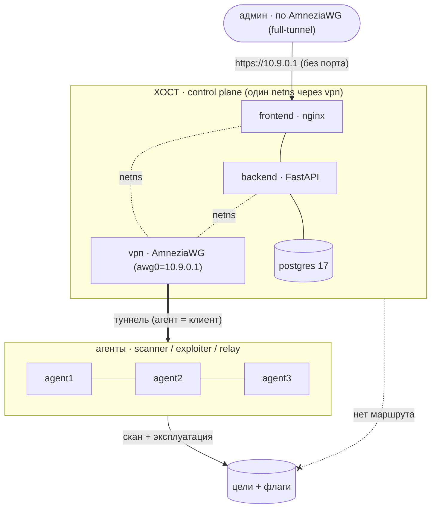

# Pintest — распределённая система сетевого аудита и CTF-эксплуатации

Система оркестрации пентеста: **хостовый сервер (control plane)** через вебку управляет
несколькими **удалёнными агент-нодами**, подключёнными по обфусцированному VPN
(**AmneziaWG**). Хост сам целей не видит — сканирование и эксплуатация идут **с агентов**,
а отчёты собираются на хосте (и дописываются по ходу). Есть отказоустойчивость,
самоуничтожение нод, DIFF, бэкапы, две механики обновлений и модульный блок CTF-эксплуатации
с гейтом подтверждения.

> ⚠️ **Только авторизованное использование** — учебный стенд / CTF / scope с разрешением.
> Сканировать и эксплуатировать чужую инфраструктуру незаконно.

> 🚀 **Не знаешь с чего начать? → [START.md](START.md)** — простыми словами: что запускать
> в лабе на своём компе, а что на реальных серверах, и что такое «релизная сборка».

---

## Что внутри (папки)

| Папка | Что это |
|-------|---------|
| [`pintest/`](pintest/) | **Эталонный аудитор** (audit.py, один файл, только stdlib). Самодостаточен — можно выкачивать/запускать отдельно. Не эксплуатирует, только выявляет. |
| [`core/`](core/) | Стековая копия движка аудита + чистка целей + сборка сводного отчёта. |
| [`exploits/`](exploits/) | Модульный блок CTF-эксплуатации: каталог + модули (`check` + `capture`). |
| [`agent/`](agent/) | Удалённая нода: приём чанков → скан, роли (scanner/exploiter), dead-man self-destruct. |
| [`host/`](host/) | Control plane: **backend** (FastAPI) · **frontend** (nginx+вебка) · **postgres** · **vpn** (AmneziaWG-сервер). fail2ban — хостовый хардненинг из `install.sh`, не контейнер. |
| [`lab/`](lab/) | **Тестовое место**: полная симуляция в Docker (хост + 3 агента + уязвимые цели) — для демонстрации преподу. |
| [`awg-base/`](awg-base/) | Общий образ AmneziaWG (userspace amneziawg-go). |
| [`docs/`](docs/) | Документация: [архитектура](docs/architecture.md) · [инструкция](docs/usage.md). |

## Быстрый старт (лаба на своём компе)

Нужен **Docker** + **Docker Compose** (Windows/Mac Desktop или Linux).

```bash
git clone <repo> pintest && cd pintest
bash lab/build.sh                      # соберёт всё и поднимет (первый раз ~5-8 мин)
```

Открой **https://localhost:8443** → прими самоподписанный сертификат → логин **admin / admin**.

> 🧭 **Прогон с нуля по шагам (WSL)** — [docs/quickstart-wsl.md](docs/quickstart-wsl.md): от `docker` до захвата флага и графа, с проверками на каждом шаге.

Дальше — по шагам из [lab/README.md](lab/README.md): подключить агентов, загрузить цели,
запустить скан, посмотреть отчёт, показать failover / self-destruct / DIFF / эксплуатацию.

**Больше устройств для ручной репетиции** — автономный скрипт [lab/polygon.sh](lab/polygon.sh)
(только docker CLI): `bash lab/polygon.sh up 30` поднимет 30 разнотипных «устройств»
(web/СУБД/камера/принтер/роутер/telnet/SCADA/VoIP), часть — изолированно.

**Что показать во фронте:** живой **граф сети** (достижимость, авто-рокировка маршрута, точки
отказа; масштаб/перетаскивание), **консоль узлов** (bash по туннелю, несколько вкладок), **лут**
(содержимое закреплений + отдельный отчёт), отчёт аудита в тёмной теме с выгрузкой md/html/csv/json.

## Перенос в реальную лабораторию (без переписывания кода)

Всё поведение — через ENV/конфиг, «лабовых» веток в продукте нет. На реальных Ubuntu-серверах:

- **Хост:** `cd host && sudo bash install.sh` (Docker, хардненинг ufw+fail2ban, стек; цветной пошаговый вывод). Адрес хоста (`AWG_ENDPOINT`) **определяется сам** — правишь `config.env` только при сложном NAT. Спросит SSH-порт (Enter — текущий; другой — безопасно перенесёт sshd). Чистый старт: `--fresh`. Вход в вебку — по VPN на `https://<host>` (bootstrap-конфиг лежит в `host/data/bootstrap-admin.conf`).
- **Агенты:** на нодах вручную ставить **ничего не нужно** и репу клонировать нельзя. В вебке → «Агенты» → «Добавить ноду»: SSH-креды сервера + галка **«полная установка»**. Хост сам зайдёт по SSH, **скопирует код с себя (без git clone)**, поставит и поднимет контейнер-агента, вбросит туннель и взведёт self-destruct. Ноде нужен только доступный SSH.

Подробно — в [docs/usage.md](docs/usage.md).

## Архитектура кратко



- **Данные — на диске** (`./data`): БД, ключи VPN, отчёты, бэкапы — переживают пересоздание контейнеров.
- **Вебка по туннелю без порта** (`https://10.9.0.1`): `frontend`+`backend` делят netns `vpn`-контейнера.
- Схема БД — [docs/schema.dbml](docs/schema.dbml). Подробнее — [docs/architecture.md](docs/architecture.md).
