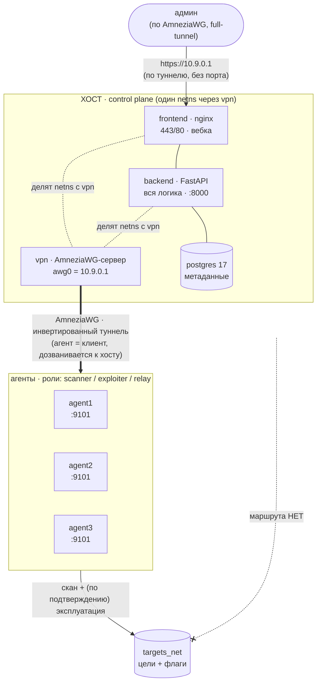
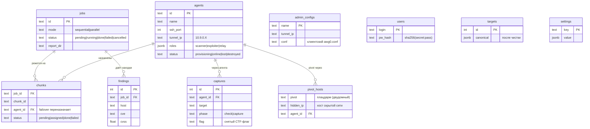

# Архитектура

## Идея

Хостовый сервер (**мастер / control plane**) сам целей не касается. Он раздаёт задания
удалённым **агент-нодам**, подключённым по обфусцированному VPN (AmneziaWG), а те сканируют
и (по подтверждению) эксплуатируют цели и **возвращают только результаты**. «Боевой» трафик
идёт с конечных нод, а данные и отчёты собираются в одном месте — на мастере.

> Хост целей не видит (`HOST -x targets_net`) — сканирует и эксплуатирует только агент.
> Вебка доступна **по туннелю без порта** (`https://10.9.0.1`), т.к. `frontend` и `backend`
> делят сетевой namespace `vpn`-контейнера (где живёт `awg0`). Данные — на диске (`./data`).

---

## Мастер (хост / control plane)

Мастер — «мозг» системы. Состоит из стандартных контейнеров; вся полезная логика — в backend.

| Контейнер | Ответственность |
|-----------|-----------------|
| **backend** (FastAPI) | Оркестрация, provisioning, VPN-управление, цели, отчёты, DIFF, бэкапы, обновления, эксплуатация. Делит netns с `vpn`, поэтому напрямую видит туннель и достаёт агентов по `10.9.0.X`. |
| **frontend** (nginx) | Статика дашборда + reverse-proxy на backend (`127.0.0.1:8000`), HTTPS (самоподпис). **Делит netns с `vpn`** → nginx слушает на `awg0`, поэтому вебка доступна **по туннелю без порта** (`https://10.9.0.1`), порты 443/80 публикуются на сервисе `vpn`. Анимированная топология, живой статус по WebSocket. |
| **postgres 17** | Durable-метаданные: агенты, джобы, чанки, находки, захваты, admin-конфиги, юзеры. Схема — [`schema.dbml`](schema.dbml). |
| **vpn** | AmneziaWG-сервер (userspace `amneziawg-go`) + внутренний control-API (пиры/ключи/статус/reload). NAT (MASQUERADE) для full-tunnel админ-клиентов (интернет через VPN). |
| **fail2ban** | Защита от перебора SSH — на **самом хосте** из `install.sh` и на **каждой агент-ноде** из `deploy.sh` (apt + systemctl, `backend=systemd`/journald + ignoreip приватных сетей). Не контейнер. |

**Модули backend** (`host/backend/app/`):
- `orchestrator.py` — чанк-леджер, раздача агентам, failover, слияние сводного отчёта.
- `provisioner.py` — SSH (paramiko): подключение к ноде, вброс AWG-ключа, поднятие туннеля.
- `vpn.py` — управление VPN-сервером (пиры, ключи, клиент-конфиги).
- `agents.py` — реестр агентов, provisioning, heartbeat, роли.
- `targets.py` — приём и чистка «грязного» списка целей.
- `reports.py` / `diff.py` — доступ к отчётам / сравнение прогонов.
- `backup.py` / `updates.py` — бэкапы / две механики обновлений.
- `exploitation.py` — координация эксплуатации (две фазы + гейт подтверждения).
- `loot.py` — сбор лута из закреплений + отдельный лут-отчёт (md/html/json).
- `topology.py` — сеть как **граф**: узлы/рёбра, достижимость (BFS), авто-рокировка маршрута, точки отказа.
- `console.py` — проброс интерактивной консоли (bash по PTY) к агенту через туннель.

**Данные — на диске** через bind-volume `./data`: отчёты (`reports/`), БД (`pg/`), ключи
агентов (`keys/`), бэкапы (`backups/`), сертификаты (`certs/`), конфиг VPN-сервера (`vpn/`).
Всё переживает пересоздание контейнеров и выкачивается с вебки.

---

## Агент (удалённая нода / exit node)

Агент — «руки» системы: он у цели под боком (в её сети), мастер — нет. Один Docker-образ
`pintest-agent`, поведение — через ENV.

| Компонент | Ответственность |
|-----------|-----------------|
| **agent_api** (FastAPI, :9101) | Приём чанков → запуск движка `core.auditor` на под-списке, стрим результатов; эксплуатация (check/capture); обновления. Доступен ТОЛЬКО по туннелю. |
| **awg-client** | Клиентская сторона AmneziaWG (конфиг вбрасывает мастер по SSH). |
| **sshd** | Только для первичного provisioning с мастера. |
| **роли** | `scanner` (по умолчанию) и `exploiter` (назначается вручную, с донастройкой). |
| **dead-man switch** | Самоуничтожение при потере связи с мастером (см. ниже). |

**Модули агента** (`agent/agent_api/`): `runner.py` (запуск движка по чанку), `roles.py`
(роли + донастройка), `exploit_runner.py` (check/capture), `deadman.py` (self-destruct),
`updater.py` (приём обновлений). Скрипты: `apply-awg.sh` (поднять туннель), `self-destruct.sh`,
`setup-exploiter.sh`, `apply-update.sh`.

**Изоляция:** агент подключён и к `mgmt_net` (provisioning/вход туннеля), и к `targets_net`
(цели). Мастер к `targets_net` НЕ подключён — поэтому сканирует только агент.

---

## Движок и эксплойты (общие)

- `pintest/audit.py` — **эталонный аудитор** (нетронут, отдельная выкачка). Не эксплуатирует.
- `core/` — стековая копия движка (правим свободно) + чистка целей + сборка сводного отчёта.
- `exploits/` — каталог модулей; каждый = `check()` (safe) + `capture()` (закрепление, с подтверждением).

---

## Как всё работает: полный цикл

### 1. Подключение ноды (provisioning)
`UI (SSH-креды)` → `backend`:
1. генерит ключевую пару AmneziaWG для ноды + выделяет туннельный IP `10.9.0.X`;
2. добавляет пир на VPN-сервере (**до** поднятия туннеля — иначе не будет handshake);
3. по SSH (paramiko) заходит на ноду и **вбрасывает** клиент-конфиг `awg0.conf`;
4. запускает `apply-awg.sh` → `awg-quick up awg0` → нода дозванивается к мастеру (инверт. туннель);
5. проверяет `/health` ноды по туннелю → нода `online`; dead-man **взведётся сам** после устойчивой связи (см. §6).

### 2. Цели
Грязный список из UI → `core.targets.canonical` (валидация, развёртывание CIDR/диапазонов,
дедупликация, отсев мусора) → канон хранится в БД.

### 3. Скан (оркестрация + failover)
- канон режется на чанки (`CHUNK_SIZE`);
- чанки раздаются онлайн-агентам: **параллельно** (веером) или **последовательно** (по очереди);
- агент гоняет `core.auditor` по чанку, отдаёт `results.jsonl`;
- мастер сливает результаты в мастер-каталог и **пересобирает отчёт после каждого чанка**
  (дописывается, а не с нуля — reuse `--resume`: `results.jsonl` + `svc_done` + `build_reports`);
- **failover:** heartbeat заметил, что агент выпал → его чанки → обратно в очередь → другим агентам.
  Идемпотентно (`svc_done`/merge отсекают уже сделанные хосты).

### 4. Отчёты и DIFF
4 формата (md/html/csv/json) на диске, выкачиваются с вебки. DIFF сравнивает находки двух прогонов
(новые/ушедшие/оставшиеся CVE).

### 5. Эксплуатация (CTF)
- роль `exploiter` назначается выбранным нодам → на них донастройка (доустановка модулей);
- **фаза 1 `check`** — безопасная проверка легитимности CVE → список эксплуатируемого в UI;
- **фаза 2 `capture`** — закрепление **только по явному подтверждению** пользователя → снятие
  флага + лут + маркер. Без подтверждения backend ничего не «дожимает». Эксплойт идёт с агента.
- **движок real-time** (`exploits/engine.py` + `catalog_data.py` + `primitives.py`): по находке скана
  собирает «модуль на лету» и запускает `auto_exploit` (check → confirm → capture); покрытие растёт
  строкой каталога, не файлом. Захваченный узел через `pivot_auto` **сам захватывает дальше**
  (self-spreading). Подробно — [`exploitation.md`](exploitation.md).

### 6. Самоуничтожение (dead-man switch)
**Взвод (arming) идемпотентный и осторожный:** нода вооружается ТОЛЬКО после того, как
установлена И получила УСТОЙЧИВУЮ связь с хостом — непрерывную reachability в течение
`DEADMAN_ARM_GRACE` (15с). Пока связь не подтверждена столько времени — нода НЕ вооружена
и себя не трогает (свежая/полу-настроенная нода не нукается зря). Reachability = ICMP-ping
хоста **ИЛИ** свежий AmneziaWG-handshake (данные шли недавно) — чтобы фильтрация ICMP при
живом туннеле не давала ложняк. `DEADMAN_TIMEOUT` (90с) ЗАМЕТНО больше keepalive (25с),
иначе обычная пауза keepalive-цикла на реальном интернете ложно триггерит вайп.
Срабатывает, чтобы «чистить хвосты» в любом раскладе: Срабатывает, чтобы «чистить хвосты» в любом раскладе:
- **сеть/порты заблокированы во время работы** → мастер недоступен дольше `DEADMAN_TIMEOUT` → вайп;
- **ноду изолировали и перезапустили** → при старте нода пробует восстановить туннель; если мастер
  недоступен за `DEADMAN_BOOT_GRACE` → немедленный вайп (быстрая чистка хвостов);
- **обычный рестарт при живом мастере** → туннель авто-восстанавливается → нода выживает;
- **ручной триггер** — кнопка «уничтожить» в UI.
Вайп: туннель вниз, стирание ключей/конфигов/результатов/кода проекта, tombstone → нода гаснет.
Стирание строго в пределах проектной папки (безопасно для остальной системы).

### 7. Бэкапы и обновления
- **Бэкапы (полноценные, по образцу каскадного шлюза):** снимок durable-СОСТОЯНИЯ —
  дамп всех таблиц БД (JSON) + отчёты + ключи агентов + **идентичность VPN-сервера**
  (`data/vpn`: server.json/awg0.conf/ключи — без них теряются туннели) + TLS-серты.
  Каждый архив: `meta.json` (версия/причина/дата/счётчики) + `sha256` (целостность).
  Причины: `manual|cron|update|pre-restore`. Перед обновлением и перед восстановлением
  снимок делается **автоматически** (есть куда откатиться). Ежедневный авто-снимок 03:30,
  ротация последних N (`BACKUP_KEEP=10`). В вебке: создать/скачать/загрузить/удалить/
  восстановить. Restore проверяет sha256, снимает pre-restore страховку, льёт файлы
  поверх + перезаливает БД + просит vpn-контейнер перечитать awg0 (иначе ключи не активны).
- **Обновления — две разные механики:** мастер обновляет себя сам, агенты обновляются
  доставкой С мастера (бандл по API-туннелю или по SSH; агент код сам не тянет).
- **Обновление мастера (кнопка «Обновить хост»):** бэкенд крутится в контейнере и НЕ может
  пересобрать сам себя, поэтому кнопка лишь ставит заявку — пишет маркер `host/data/.update-request`.
  На самом хосте крутится демон `sudo bash host/update.sh --watch`, который ловит маркер и делает
  `git fetch` + `git reset --hard <remote>/<branch>` + `docker compose up -d --build`
  с **авто-откатом** на прежний коммит при любой ошибке. Разовый прогон без вебки: `sudo bash host/update.sh`.

---

### 8. Визуализация, консоль, лут
- **Граф сети** (`topology.py` + `frontend/topology.js`): сеть строится как живой force-directed
  граф HOST→агенты→цели, с pan/zoom, авто-вписыванием и авторазведением подписей (масштабируется на
  много устройств/сетей). Узлы — чёткие SVG-иконки (host=сервер, агент=CPU, цель=check/alert/
  crosshair/flag), у каждого состояния свой цвет/анимация.
- **Живое построение в реальном времени.** По мере скана цели проходят стадии, каждая со своей
  анимацией: `очередь → пинг (wifi, синяя волна) → живой (пульс, бирюзовое вращение = скан портов)
  → статус`. Данные настоящие: агент отдаёт поштучные `alive` (ответили на discovery) и `scanned`
  (глубокий скан) из `alive_*.txt`/`results.jsonl`; оркестратор держит `LIVE_STAGE` (ip→стадия),
  топология накладывает их на узлы. Сетка «прорастает» на глазах.
- **Самовосстановление (self-heal).** Достижимость — BFS от хоста с fixpoint (`resolve_mesh`).
  Агент падает → его цели **рокируются** на другого живого агента-кандидата; если прямого агента в
  подсети не осталось, но там есть **захваченный узел**, он становится **реле** (плацдарм → «агент
  для хоста»), и сеть за ним не теряется. «Точки отказа» (`single_points_mesh`) считаются с учётом
  реле — их тем меньше, чем больше плацдармов. Граф перестраивается в реальном времени.
- **Консоль узлов** (`console.py` + агентский PTY): полноценный bash на ноде из вебки, через
  туннель, несколько вкладок. Вебка к ноде напрямую не ходит — только через хост.
- **Лут** (`loot.py`): содержимое успешных закреплений (shell/RCE-вывод, флаг, маркер, лог)
  собирается из БД и выгружается отдельным лут-отчётом (md/html/json). Отчёт аудита рендерится
  нативно в тёмной теме + выгрузка md/html/csv/json.

### 9. Реальный pivot (разведка скрытой сети через захваченный узел)
Захваченный **двудомный** узел (плацдарм) реально пробрасывает трафик в сегмент, куда агенты
не имеют маршрута:
- модуль эксплуатации реализует `pivot_scan(target, subnet)` — через полученный foothold
  (у vsftpd — рут-шелл бэкдора на 6200) на самом плацдарме запускается потоковый скан скрытой
  подсети; трафик к скрытым хостам идёт ЧЕРЕЗ плацдарм, не с агента;
- агент (`/pivot`) → бэкенд (`/api/pivot/scan`) → найденные скрытые хосты пишутся в `pivot_hosts`;
- топология добавляет их узлами **за реле-плацдармом** (метка `H`, «скрыт»), достижимыми только
  через него. В лабе за pivot'ом (vsftpd `172.30.0.11` / `10.66.0.2`) сидит изолированная сеть
  `10.66.0.0/24` (`internal`), которую агенты физически не видят — только через захват;
- **эксплуатация через pivot** (не только разведка): `remote_cmd()` целевого модуля (one-liner
  эксплойта) прогоняется `shell_exec()`-ом плацдарма → скрытая цель бьётся её же трафиком через
  захваченный узел. Успех пишется как capture, скрытая цель в графе становится «обработана».
- **все модули pivot-способны**: `pivot_scan` — **generic в базе** (через `shell_exec` любого модуля,
  так любой захваченный узел с shell-каналом становится плацдармом), а каждый модуль реализует
  `shell_exec` (команда на взятом хосте: бэкдор vsftpd / RCE apache / CGI shellshock) и `remote_cmd`
  (безопасный base64-one-liner эксплойта для запуска на плацдарме). Новый модуль-устройство —
  просто файл в `exploits/modules/` с этими методами (каталог подхватывает автоматически).

### 10. Консоль узлов и захваченных целей
- **Агенты** — полноценный bash по PTY (см. п.8).
- **Захваченные цели** — командная консоль через их **foothold** (`shell_exec` модуля: бэкдор-шелл
  vsftpd / RCE apache): вкладка «Консоль» → выбрать захваченную цель → команды идут `браузер →
  хост → агент → foothold цели`. Не PTY (каждая команда — отдельный вызов), но достаточно для
  управления взятым хостом.

### 11. Админский VPN-доступ (full-tunnel: вебка + интернет через VPN)
Админ подключается к вебке НЕ напрямую, а по AmneziaWG. Хост генерирует персональный клиентский
`awg0.conf` (`admin_vpn.create`: ключи + туннельный IP с верхнего конца диапазона + пир на сервере)
— админ скачивает `.conf` во вкладке «VPN» (или берёт bootstrap-конфиг после install), поднимает
туннель и открывает `https://10.9.0.1` (адрес хоста в туннеле, без порта).
- **Full-tunnel по умолчанию** (`ADMIN_VPN_FULL_TUNNEL=1`): `AllowedIPs = 0.0.0.0/0, ::/0` —
  через VPN идёт И вебка, И интернет; сервер NAT-ит трафик в WAN (`awg.ensure_forwarding`:
  MASQUERADE `10.9.0.0/24` → WAN + forward). Клиент-конфиг: `MTU=1280` + обфускация-параметры
  сервера (Jc/Jmin/Jmax/S1/S2/H1-4, должны совпадать с сервером) + `DNS` (`ADMIN_VPN_DNS`).
- Агентам, наоборот, выдаётся split `AllowedIPs = 10.9.0.0/24` (их интернет через хост не гоним).
  `ADMIN_VPN_FULL_TUNNEL=0` → админам тоже split.

### Автоопределение адреса хоста
Клиент-конфигу агента нужен адрес, куда звонить. `AWG_ENDPOINT` теперь **опционален**: если пуст,
`vpn/awg.resolved_endpoint()` определяет адрес сам (внешний сервис → IP исходящего интерфейса).
Хардкодить не нужно; задаётся явно только при сложном NAT.

## Схема БД (PostgreSQL 17)

Полная схема в формате **DBML** — [`schema.dbml`](schema.dbml) (вставь на
[dbdiagram.io](https://dbdiagram.io) для интерактивной ER-диаграммы). В самой БД внешних
ключей нет — связи логические (id-агентов/джоб как TEXT), показаны ниже как их читает код.

Отдельные (без связей) таблицы: `targets` (списки целей из UI), `admin_configs` (VPN-доступы),
`users` (аккаунты вебки), `settings` (key/value). Время — epoch-секунды (`double precision`).

---

## Установка, хардненинг, обновления

- **Хост:** `sudo bash host/install.sh` — Docker → хардненинг → сборка стека. Цветной пошаговый
  вывод (шумный apt/docker — в `/tmp/pintest-setup.log`); общий `host/lib.sh` (шаги, мягкий мерж
  `config.env`, `detect_ssh_port`). PG17; `--fresh` = чистый старт (снести `host/data`).
- **SSH-порт при установке:** можно перенести sshd на нестандартный порт — `sed Port` +
  **маскировка `ssh.socket`** (иначе socket-активация Ubuntu 24.04 вернёт 22 после апдейта);
  ufw включается только после подтверждения (`ss`), что порт слушает — **без лок-аута**.
- **Хардненинг:** ufw (SSH-порт + 80/443 + 51820/udp), fail2ban (`backend=systemd`/journald +
  ignoreip приватных сетей — админ из VPN/LAN себя не забанит), sysctl (SYN-флуд/спуфинг).
  На агент-нодах — тот же fail2ban+ufw из `deploy.sh` под её реальный SSH-порт (от root).
- **Мягкий мерж `config.env`:** install/update дописывают в существующий конфиг только
  недостающие ключи из `config.example.env`, не трогая значения.

## Переносимость

Продуктовый код (`pintest/`, `core/`, `exploits/`, `agent/`, `host/`) не содержит «лабовых»
веток — всё через ENV. `lab/` только инстанцирует те же образы и разводит сети. Перенос в
реальную лабу = запуск тех же `install.sh` на реальных серверах, правятся лишь адреса/креды.
